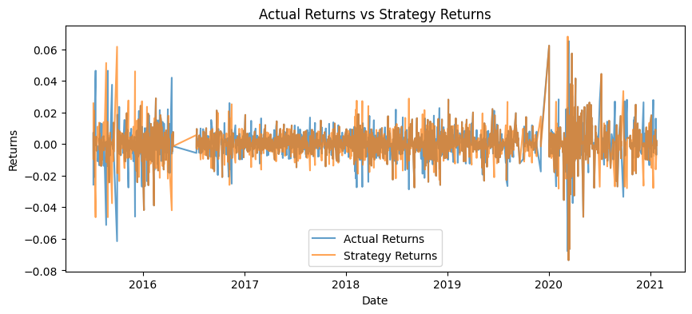
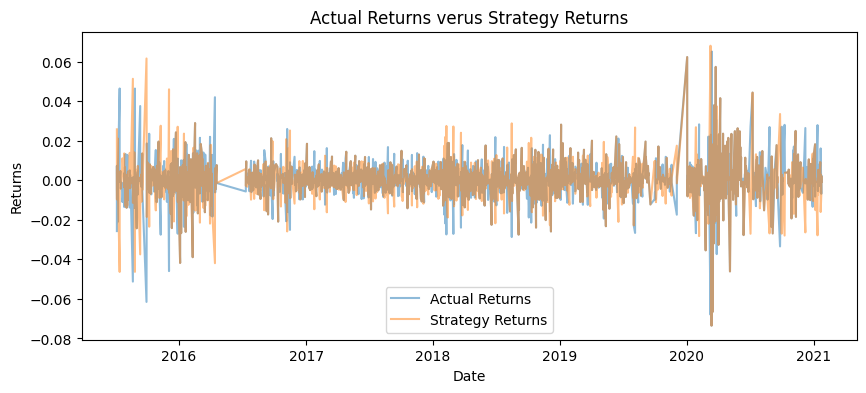

# Machine Learning Trading Bot

## Overview
This project is an enhancement of an existing algorithmic trading system with machine learning to adapt to new data, aiming to maintain a competitive edge in the market.

## Baseline Performance
The baseline trading algorithm was established using an `SVC` classifier from SKLearn. This involved:
- Importing the OHLCV dataset.
- Generating trading signals with SMA values.
- Splitting data into training and testing datasets.
- Fitting the model and making predictions.
- Reviewing a classification report and creating prediction DataFrames.

The baseline performance was visualized with a cumulative return plot comparing actual returns to strategy returns.

## Algorithm Tuning
The model was tuned by:
1. Adjusting the size of the training dataset, which impacted the model's ability to generalize to unseen data.
2. Modifying the SMA input features, affecting the sensitivity of the trading signals.

The optimal parameters were identified, resulting in an improved trading algorithm.

## New Machine Learning Classifier Evaluation
A new classifier was implemented and backtested against the baseline model:
- Compared models using the cumulative product of actual vs. strategy returns.
- Evaluated performance improvements over the baseline and tuned models.
## Conclusions
My final conclusion is that algorithm tuning is important, demonstrating that if a model is tuned properly it can perform more accuracte to actual returns, which improves profits and future predicitions.